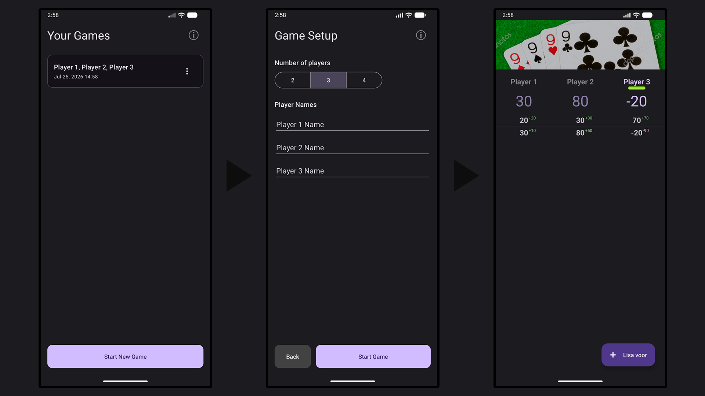

# "Tuhat" card game point tracker
---

# Installation

## Using the release version APK

1. Download the APK from the [release page](https://github.com/hacker30083/tuhat-app/releases). 
2. Open the file on your android phone.
3. Follow on-screen instructions to install the application
## Building from source

### 1. Get the clone from GitHub
` git clone https://github.com/hacker30083/tuhat-app `
### 2. Build the application using Android Studio
If you are unfamiliar with Android Studio follow the tutorial [here](https://developer.android.com/studio/run)

# Development

Steps to contribute to the project:
1. Fork the repository
2. Make your changes
3. Make a PR for me to review and merge into the repository
